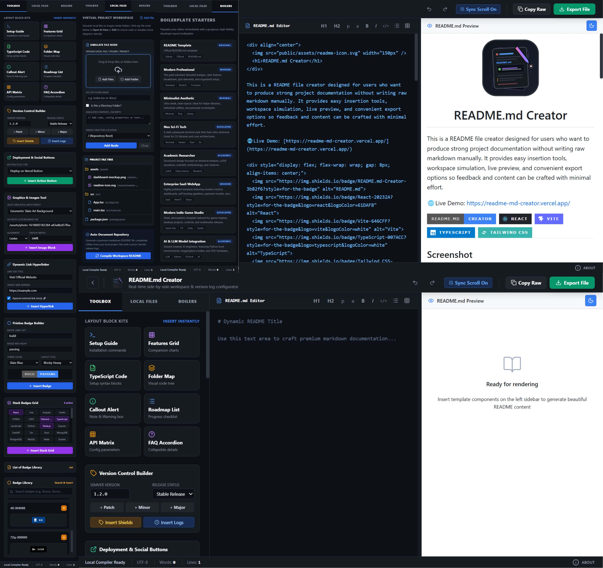

<div align="center">
  
  <h1>README.md Creator</h1>
</div>

This is a README file creator designed for users who want to produce strong project documentation without writing raw markdown manually. It provides easy insertion tools, workspace simulation, live preview, and convenient export options so feedback and content can be crafted with minimal effort.

🌐Live Demo: [https://readme-md-creator.vercel.app/](https://readme-md-creator.vercel.app/)

<div style="display: flex; flex-wrap: wrap; gap: 8px; align-items: center;">
  
  
  
  
  
  
</div>

---
## Screenshot




## 🧑🏻‍💻 Tech Used

- React
- TypeScript
- Vite
- Tailwind-style CSS classes
- `react-markdown`
- `remark-gfm`
- `rehype-raw`

---

## 📂 System Project Structure

Here is a visual map of the files in this simulated repository:

```
my-awesome-project/
├── src/
│   ├── data/
│   │   ├── badges.ts
│   │   └── templates.ts
│   ├── App.tsx
│   ├── index.css
│   ├── main.tsx
│   └── types.ts
├── public/
│   ├── assets/
│   │   ├── favicon.png
│   │   ├── horizontal-bar.svg
│   │   ├── List_of_Badge_Library.txt
│   │   ├── readme-icon-nobg.svg
│   │   └── readme-icon.svg
│   └── favicon.png
├── .dockerignore
├── docker-compose.yml
├── Dockerfile
├── index.html
├── metadata.json
├── package.json
├── README.md
├── server.ts
├── tsconfig.json
└── vite.config.ts
```

---

## 🛠️ Installation
1. Clone the repository:
```bash
git clone https://github.com/rajprajapati2001/README.md-Creator.git
cd README.md-Creator
```

2. Install dependencies:
```bash
npm install
```

3. Start the development server:
```bash
npm run dev
```

4. Open the app in your browser at the address `localhost:3000`.

---
## 🐳 Docker Setup
Using Docker Compose, includes a `docker-compose.yml` file, you can spin up the entire stack with a single command.

1. Start the containers:
```bash
docker compose up
```

2. Stop and remove the containers:
```bash
docker compose down
```

3. Remove Images:
```bash
docker images -a
docker rmi <image-ID>
```


## 📜 License & Citation
This project is available under the **MIT License**.

## ℹ️ About
Dev: `Raj Prajapati` + `Devendra Chauhan` on `24th June 2026`